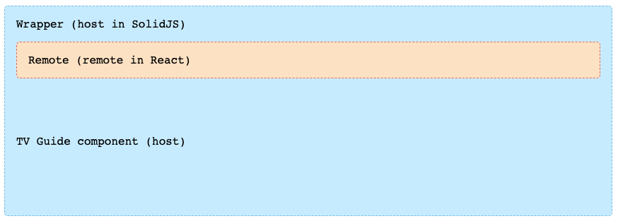

# SolidJS SSR demo with React module federation
This repo demonstrates how to implement SolidJS SSR with module federation. For this example we're using a React based app to expose a component.

We're using the OriginJS's Module Federation plugin for Vite. [@originjs/vite-plugin-federation](https://github.com/originjs/vite-plugin-federation)

And [vite-plugin-ssr](https://vite-plugin-ssr.com/) for SSR.

## Host
The host is a SolidJS SSR app which wraps the entire application. This is what the end-user would interact with.

Key files to look at:
- `/host/vite.config.js` - this implements the `federation` plugin and defines the `remotes` it wants to access.
- `/host/src/components/RemoteNav.tsx` - this imports the `Nav` component from the remote.
- `/host/pages/index.page/tsx` - This is the homepage - uses the `RemoteNav` component.

### Architecture
Diagram below demonstrates the architecture of the app:



## Remote
The remote is a React (although other frameworks are supported by the Federation plugin) app which exposes a `Nav` component.

Key files to look at:
- `/remote/src/components/Nav.jsx` - this is the component to be exposed
- `/remote/vite.config.js` - this implements the `federation` plugin and exposes the component. It also shares `react` and `react-dom` libraries.

## Getting it running

Firstly with need to build and start the remote, the remote will start on port 5001.

From the root directory run:
```
cd remote && pnpm i && pnpm build && pnpm serve
```

Now, let's start the host app, this will start on port 3000.

From the root directory run:
```
cd host && pnpm i && pnpm dev
```

Navigate to [http://localhost:3000/](http://localhost:3000/) and the app should be running.

## Known issues

An issue exists with the Module Federation plugin that might prevent some React components with hooks from being able to be imported - https://github.com/originjs/vite-plugin-federation/issues/294 

## Thanks
Thanks to [Rom](https://github.com/brillout) for his example of [SolidJS SSR](https://github.com/brillout/vite-plugin-ssr/tree/main/examples/solid-ssr/).
